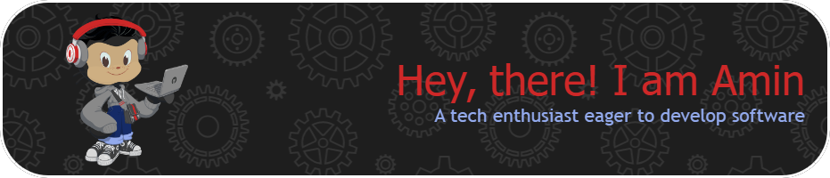

##  &nbsp; About me

- 🎓 Studying as a Mechanical Engineer in **Shiraz University**
- 💻 Love learning about new technologies and concepts
- 👨‍💻 Enjoy writing programs especially for web
- 🌱 Currently learning **C++** and **Matlab**
- 👨‍💻 All of my projects are available at [my github](https://github.com/amin-not-found)

 

## Languages

## Technologies

## Github stats

